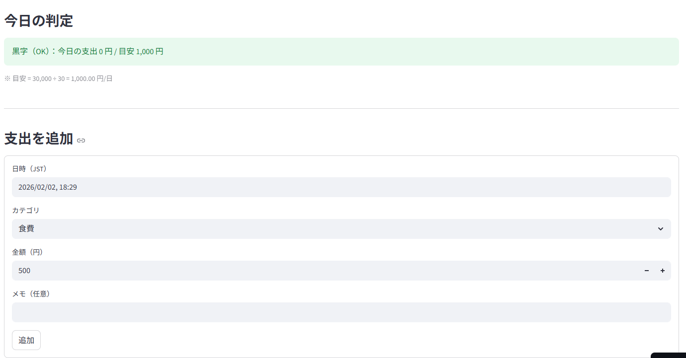

# 💰 収支管理アプリ

## 概要
毎日の支出を入力するだけで、  
**「今日使ってよい金額かどうか」** を自動で判定してくれる  
シンプルな収支管理アプリです。

月の目標金額と残り日数から **1日あたりの目安金額** を算出し、  
当日の支出がその範囲内かを **色付き（黒字 / 注意 / 赤字）** で表示します。

Python（Streamlit）と Supabase を用いて作成しました。

---

## 主な機能
- 月の目標金額を設定
- 今月の残り日数を入力
- 今日の支出を入力
- 1日あたりの目安金額を自動計算
- 支出状況を以下の3段階で判定  
  - 🟢 黒字（目安以内）  
  - 🟡 注意（目安に近い）  
  - 🔴 赤字（目安オーバー）
- 支出データを Supabase に保存

---

## 使用技術
- Python
- Streamlit
- Supabase
- GitHub

---

## アプリURL
以下のURLからアプリを試すことができます。  
（Streamlit Cloud 上で動作）

👉 https://blank-app-me2rpxwqjn8.streamlit.app/

---

## 開発時に工夫した点・大変だった点
- **Supabaseとの接続（Secrets管理）** に苦戦しました  
  → APIキーをコードに直接書かず、Streamlit Cloud の Secrets 機能を使って安全に管理しました。
- 初心者でも直感的に使えるよう、  
  **数値だけでなく色による判定表示** を採用しました。

---

## スクリーンショット
※ アプリの代表的な画面を以下に示します。

